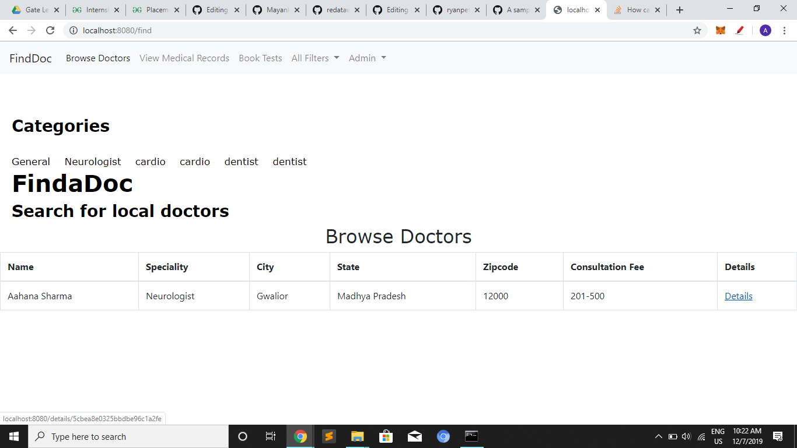
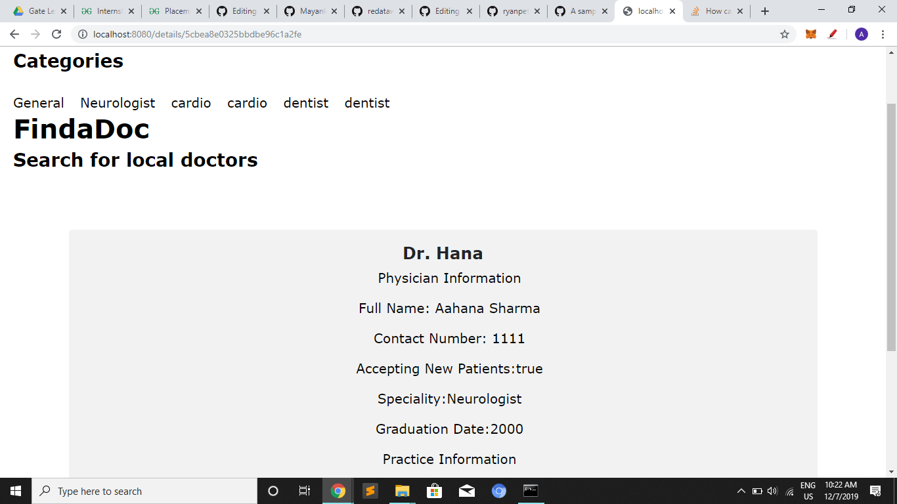
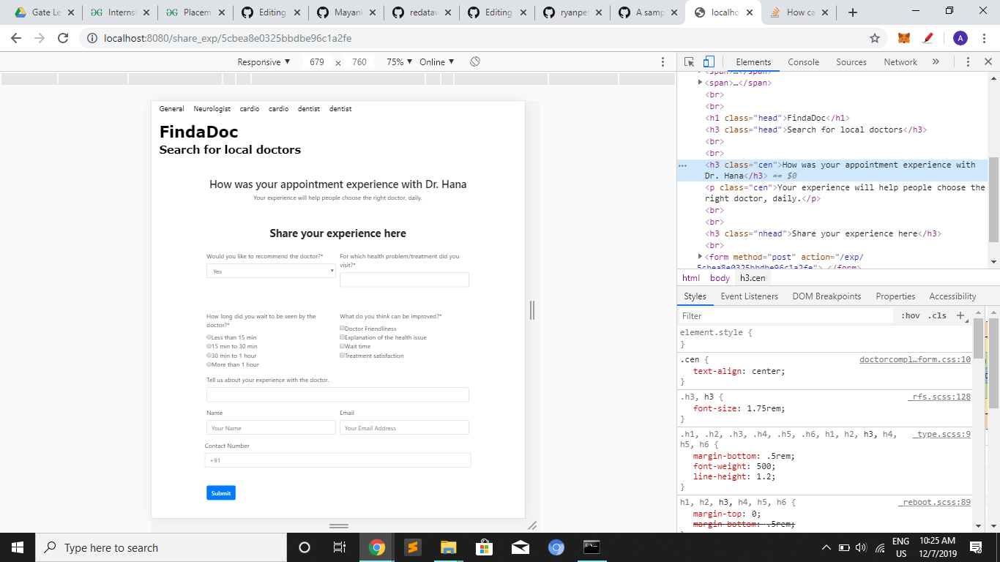
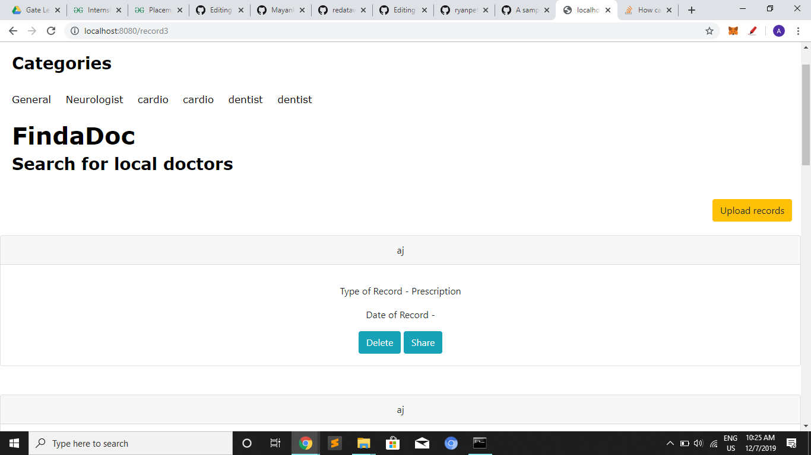
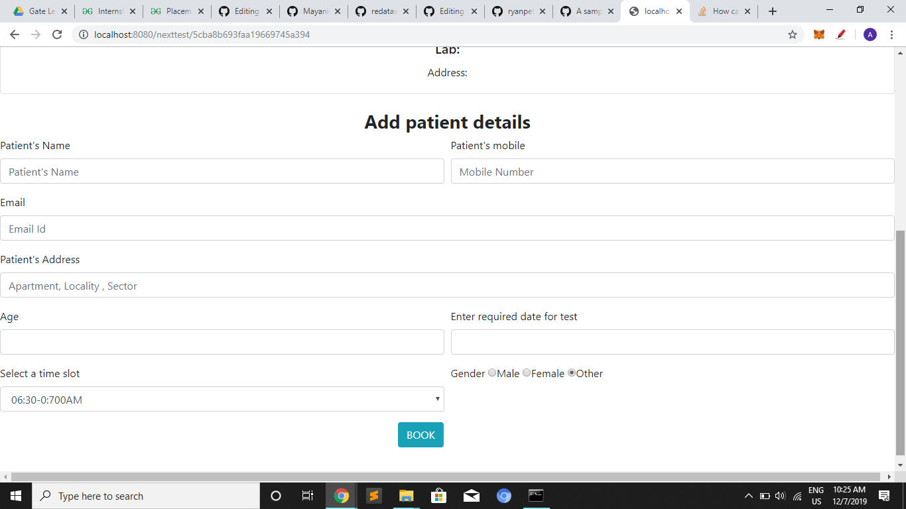

# Doctor Finder

Web App that allows users to serch for doctors by their location or their condition

## Description
FindDoc is a web app help you locate the best doctor in your location. You can search either a specialist doctor or search by your location. When submitted the api is called and a list of doctors is displayed for the user.

## Features
* Search for doctors by location or Medical Speciality.
* View doctor's profile which displays all information about doctor such as doctor's name, contact info, address, speciality etc.
* View other people's experiences and comments for a particular doctor and share your experience also.
* Make an appointment and have an online chat with a specific doctor.
* View, save and upload your new medical records in this web app.
* Can book and make appointments for home test.

## Setup/Installation Requirements
* Download or clone git repo at
* Run npm install
* Run node index.js
* Index.js should open up on your default browser, if not, go to localhost:8080

## Screenshots
         

## Technologies Used
* HTML/CSS
* Javascript
* Jquery/Bootstrap
* NodeJS with Express(ejs template engine)
* Mongodb
